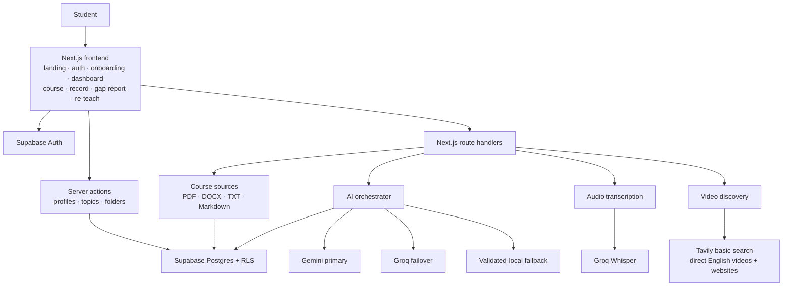

# Explainaloud production architecture

This document describes the code that is currently deployable. It deliberately
does not claim future LMS features that are not implemented.

## Runtime flow

## Course creation

1. Email/password students verify the emailed confirmation link before
   onboarding. Google identities arrive provider-verified and continue directly.
2. They create a topic and may upload source files.
3. `POST /api/courses/[courseId]/generate` authenticates the request and loads
   only rows owned by that user.
4. Source Scout chooses grounded or open-knowledge mode.
5. Course Architect generates sections, explanations, examples, key points,
   checks, notes, and video search phrases.
6. Accuracy Reviewer independently checks grounding, coverage, pedagogy, and
   assessment. A Revision Specialist runs only when the review finds issues.
7. Video Researcher makes one Tavily `basic` search and accepts only direct,
   topic-matching English YouTube watch URLs.
8. Resource Researcher makes one parallel Tavily `basic` search and accepts
   only direct English educational pages, never search-result URLs.
9. The validated course and its agent trace are saved in `courses.generated`.

## Teach-back and gap report

1. `MediaRecorder` captures the complete local audio stream. Browser speech
   recognition provides immediate captions when available.
2. If browser captions lose their network connection, the app periodically
   sends recorded audio to the transcription route without stopping the mic.
3. The transcript is saved to `course_sessions` before grading begins.
4. Transcript Evaluator checks the explanation against every generated course
   key point and colours accurate and inaccurate transcript spans.
5. Gap Coach runs only after the student finishes. The final score combines
   course coverage with claim accuracy, and every uncovered course key point is
   included in the report.
6. Provider timeouts, rate limits, or malformed AI output degrade to validated
   local evaluation instead of losing the session.
7. The report is persisted to `course_sessions` and `gaps`, then shown in Gap
   Report and Re-Teach.

## Current route handlers

| Route | Responsibility |
|---|---|
| `/auth/callback` | Supabase OAuth/email callback and onboarding routing |
| `/dashboard/admin` | Read-only user and topic aggregates for the verified admin |
| `/api/courses/[courseId]/generate` | Course agent orchestration and save |
| `/api/courses/[courseId]/sources` | Owned source upload, preview, and removal |
| `/api/courses/[courseId]/videos` | Direct English video and website refresh |
| `/api/courses/[courseId]/transcribe` | Recorded-audio transcription |
| `/api/courses/[courseId]/analyze` | Live transcript evaluation and final report |

Authentication, profiles, folders, topic creation, renaming, movement, and
deletion use authenticated Server Actions or Supabase SSR rather than duplicate
REST routes.

The admin dashboard is protected twice: the server route requires the verified
administrator, and a security-definer database RPC repeats that identity check
before returning limited aggregate fields. It never returns source content,
notes, generated lessons, transcripts, or gaps. The same database check bypasses
daily topic and recording counts for the administrator; ordinary account limits
remain fixed inside the quota function.

## Current database

| Table | Purpose |
|---|---|
| `profiles` | Onboarding name, date of birth, and use type |
| `folders` | User-owned dashboard organization |
| `courses` | Topic metadata and validated generated course JSON |
| `course_sources` | Parsed, user-owned source content |
| `course_sessions` | Transcript, evaluated spans, report, and score |
| `gaps` | Individual weaknesses used by Gap Report and Re-Teach |
| `usage_daily` | Atomic daily topic and recording limits |
| `waitlist_signups` | Legacy landing-page data; not used by the current auth flow |

All application tables have RLS enabled. User data policies match
`auth.uid()` to the row owner. The browser receives only the Supabase public
key; AI and search credentials remain server-only.

## Not part of this release

The current product does not implement a general AI chat, standalone quiz
submission/grading, lesson-level completion tracking, separate module/lesson
tables, Supabase Storage, pgvector, or the YouTube Data API. Course learning
checks are generated inside each course section, videos are discovered through
Tavily, and mastery is represented by teach-back sessions and gap scores.

Those capabilities should be planned as separate schema, API, and product
changes rather than being represented as already shipped.
